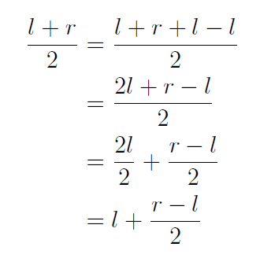

### Data Structures & Algorithms

# Table of Contents

| Section | Title |
| ------- | ----- |
| 01 | [Binary Search](#01) |
| 02 | [Dynamic Programming](#02) |
| 03 | [Segment Tree](#03) |


<a id="01"></a>
# Binary Search

[Reference Link](https://www.topcoder.com/community/competitive-programming/tutorials/binary-search)

Only works if the ordered data is either constantly increasing or decreasing (non-changing is fine too).
- If the condition is viewed as a boolean return and the data looks like this (FFFFFFFTTTTTTT), then binary will work.

```python
def binary_search():
    lo = min_possible_val - 1
    hi = max_possible_val + 1

    while lo != hi - 1:                 # lo and hi will converge until they are next to each other
        mid = lo + (hi - lo) // 2       # same as (lo + hi) // 2, but prevents integer overflow

        if f(mid) == True:
            hi = mid                    # can also set this to lo based off of needs
        else:
            lo = mid

    return lo                           # return lo or hi based off of needs
```

Time complexity - O(log n)

## Calculating `mid`

Proving that `(lo + hi) // 2 == lo + (hi - lo) // 2`



<a id="02"></a>
# Dynamic Programming (Memoization)

Storing values so you don't need to recalculate them.

## Popular Problems

### Knapsack

Given a knapsack and an array of items with weights, determine if you can fill the knapsack completely (each item can only be chosen once).

```python
def knapsack(items, maxSize):
    n = len(items)
    dp = [0] * (maxSize + 1)
    
    dp[0] = 1
    for i in range(n):
        for j in range(maxSize, items[i]-1, -1):
            dp[j] |= dp[j - items[i]]                   # bitwise OR

    return dp[maxSize]
```

Time complexity - O(n\*m) where n is item length, m is maxSize <br/>
Space complexity - O(m)

NOTE: If items can be chosen multiple times, then flip the direction of the second loop.

<a id="03"></a>
# Segment Tree

What is it? _It's a tree of segments dumbasssss_

Great for range queries

Say this is your array: `[3, 1, 2, 5, 6, 8, 3, 2]`

Then this would be your segment tree of sums:


The total number of nodes will always be to the power of 2 b/c it's a binary tree <br/>
If the original length of the array is not a power of 2, just pad the tree with zeros

There are different implementations. This is the most readable:

```python
segtree_n = 2 ** 17                                                 # usually this amt of nodes is enough
segtree = [0] * 2 * segtree_n

def set(i, v, x=0, lo=0, hi=segtree_n):
    if hi - lo == 1:                                                # reached the bottom
        segtree[x] = v;
        return

    mid = (lo + hi) // 2
    if i < mid:
        set(i, v, 2*x+1, lo, mid)
    else:
        set(i, v, 2*x+2, mid, hi)

    segtree[x] = segtree[2*x+1] + segtree[2*x+2]                    # operation changes based off needs


def get(target_lo, target_hi, x=0, lo=0, hi=segtree_n):
    if target_lo >= hi or target_hi <= lo: return 0                 # range is out of bounds
    if target_lo <= lo and target_hi >= hi: return segtree[x]       # range is in bounds

    mid = (lo + hi) // 2                                            # range is partially in bounds
    a = get(target_lo, target_hi, 2*x+1, lo, mid)
    b = get(target_lo, target_hi, 2*x+2, mid, hi)

    return a + b                                                    # again, operation changes
```

Setting/updating a value takes O(log n) time <br/>
Getting a segment takes O(log n) time

## Lazy Propagation

Sometimes you don't just want to update one value at a time. Sometimes you want to update _ranges_ of values.

w/o lazy prop it'll take O(nlog n) time. _TOO SLOW!!!_ w/ lazy prop it'll take O(log n)