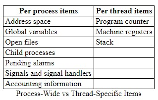

# Chapter 2: Process & Thread Management

## Processes

__Process:__ program in execution

Each process thinks that its always running, has all the memory, etc. (due to abstraction)

In reality, multiprogramming switches between processes really fast. 

Process creation:
1. System initialization, including daemon (see below) processes.
2. __Execution of a process creation system call (e.g., `fork()`) by a running process.__
3. A user request to create a new process.
4. Initiation of a batch job.

__Daemon__ processes work in the background.

Process termination:
1. Normal exit (voluntary).
2. Error exit (voluntary).
3. Fatal error (involuntary).
4. Killed by another process (involuntary).

`kill()` and `exit()`

__Process States & Transitions__

*Ready:* ready to be put into the CPU

*Running:* CPU is currently working on it

*Blocked:* waiting on some event (resource becoming available, I/O operation, etc.)

A microkernel has a *scheduler, interrupt handler,* and *inter-process communication (IPC)* to work on processes.

Interupts are hard to reproduce and hard to log. 

## Threads

__thread:__ independent sequence of operations being performed by the processor. Aka *lightweight processes*

One processor can have multiple threads, switching threads is much faster than switching processes. No limit to the amount of threads that can be created.

Threads within the same process share memory.

## Process Scheduling

*If you have several waiting processes, which one do you pick to run?*

