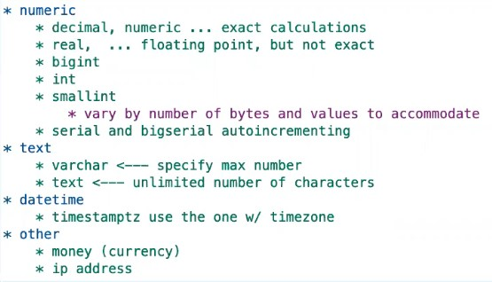
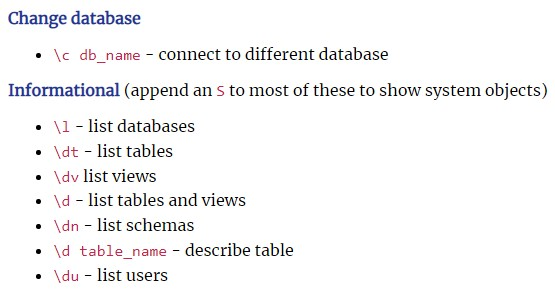

### CSCI-UA.479: Data Management & Analysis

#### Prof. Joseph Versoza, Spring 2021

*PRETTY MUCH EVERYTHING IS DONE IN PYTHON*

# Table of Contents

| Section | Title |
| ------- | ----- |
| 01 | [Unicode & Strings](#01) |
| 02 | [Functions & Functions as Objects](#02) |
| 03 | [List Comprehension, Looping, Iterables](#03) |
| 04 | [Data File Formats](#04) |
| 05 | [Stats & Stats Libraries](#05) |
| 06 | [Regular Expressions](#06) |
| 07 | [Screen Scraping](#07) |
| 08 | [Databases Intro](#08) |
| 09 | [Postgres](#09) |

<a id="01"></a>
# Unicode & Strings

*Python protip:* use `int('100', 2)` and `format(4, 'b')` to convert binary to decimal and decimal to binary

Unicode is a concept. Idea behind it is to cover the entire world's characters (emojis 😂, languages 中文, etc).

1. mapping number to char
	- ASCII
	- Unicode
2. the actual way we do that... is encoding
	- ASCII (7 bits, 8 for extended)
	- UTF-8 (1 to 4 bytes)
		- 1st byte determines the no. of bytes
		- 1110xxxx 10xxxxxx 10xxxxxx
	- UTF-16 (2 bytes or 4 bytes)
	- UTF-32 (4 bytes)
	- many others...

It could be hard to know how a file is encoded. Thats why it's often specified in the HTML header in webpages.

UTF-8 is backwards compatable w/ ASCII, utf-8 is most popular.


### String Formatting

`"Hi, my name is {2:s}, and I have {0:.2f} {1:s}!".format(20, 'apple pies', 'joe')`

Prints out 'Hi, my name is joe, and I have 20.00 apple pies!'

*f-strings*: a less verbose version of `str.format()`, introduced in Python 3.6

<a id="02"></a>
# Functions & Functions as Objects

\* in fuctions turns arguments into a tuple and ** turns args into dictionarys

you can preset arguments into default values

### Classes

Double underscore methods (aka magic methods) are special, here are some examples

1. \_\_init__(self, ...): constructor
2. \_\_str__(self): called when instance is converted to str (human readable)
3. \_\_repr__(self): string representation for debugging (for example), evaluating in interactive shell
4. \_\_eq__(self, other): specifies how `==` behaves (what is necessary for two instances to be equal?)
5. ([more online](https://docs.python.org/3/reference/datamodel.html#special-method-names) for documentation)

Static methods will need a __decorator__ `@staticmethod` to identify is as such

<a id="03"></a>
# List Comprehension, Looping, Iterables

list comprehension - `[i for i in range(50) if i > 5]`

`enumerate()` allows you to index and iterate at the same time

### Iterators & Generators

Every iterable has an implemented `__next__`

Every generator is an iterable, but not vice versa. Generators also cannot go backwards.

Generator uses `yield`, like returning and pausing a function in the middle.

generator comprehension uses parentheses instead of brackets - `(i for i in range(50))` 

<a id="04"></a>
# Data File Formats

TXT, CSV, XML, JSON

unstructured data: books, images, health records, etc.

- CSV can be read with `split(',')` but you need to be careful about commas in text. Therefore, check for \ escapes in text.
	- `import csv` and `csv.reader()` or `csv.DictReader()` handles in-text commas

When you find data you should
1. document where it came from
2. figure out what its license is 
3. document when you retrieve it
4. determine how it was collected / critical thinking about methodology

<a id="05"></a>
# Stats & Stats Libraries 

1. range `max` minus `min`
2. central tendancy
	- mean
	- median
	- mode
3. dispersion 
	- stdev
	- mean abs deviation (MAD)

## NumPy

`import numpy as np`

Implemented in C, so it's fasttt

### Arrays

*numpy arrays* - same data type, fixed size (can be reshaped tho - `arr.shape = (3, 3)`). Overall easier to perform operations on

- Ways to create arrays:
	- `np.array(list)`
	- `np.arange(val)`
	- `np.ones(shape)`, `np.zeros(shape)`

Indexing with tuples (??)

Assignment changes all elements (vectorized)

`axis=0` is columns, `axis=1` is rows

## Matplotlib

`import matplotlib.pyplot as plt`

- `plt.plot(x, y)` makes a simple graph. `plt.subplot()` for multiple displays
	- can customize the color, line pattern, xtick, ytick, labels, etc...
	- can add multiple lines

`plt.bar()` is a bar chart

`plt.scatter()` scatter plot

## Pandas

`import pandas as pd`

Numpy, but tabular

- Data types:
	- __Series__, dictionary with ordered key/val pairs and duplicates. Like the LabeledList made for HW
		- created by `pd.Series()`. Pass in list, dict, 
		- comparisons
		- filtering with booleans
	- __DataFrame__, a table. Like the Table made for HW
		- create by `pd.DataFrame()`
	- __Index__

little to no streaming, not friendly w/ big data

### Joining Data

`pd.merge()` joins databases based on common column values

`pd.concat()` joins rows together

### Data Aggregation

`pd.DataFrame.set_index()` turns column(s) into index(es)

`pd.DataFrame.groupby()` groups data together, the grouped value becomes the index (?), ex `df['Salary'].groupby(df['Year']).mean()`

<a id="06"></a>
# Regular Expressions (Regex)

`import re`

- Searching for a *pattern* in a string
	- has more functionality than `in` or `split()` since those guys have to search for a *target string*

Regex is common accross other languages (invented in the 1950s)

Common functions include: `re.match(pattern, string)`, `re.search()`, `re.findall()`, `re.split()`

Syntax for... character classes:


Location:


Quantifiers:


Pandas has built in regex functions `str.match(pattern)` and `str.extract(pattern)`. The latter must contain subgroups.

<a id="07"></a>
# Screen Scraping

### Data Formats on the Web

Most of the web's data is hierarchical (html, xml, json)

- pain in the ass to parse
	- *SOLUTION:* find a library that parses it for you
		- [beautiful soup 4](http://www.crummy.com/software/BeautifulSoup/bs4/doc/)
		- [scrapy](https://scrapy.org/)
		- [requests-html](https://requests.readthedocs.io/projects/requests-html/en/latest/)

`import json` converts betwen JSON and dictionaries

### Making Web Requests, Using APIs

HTTP/HTTPS - Hypertext Transfer Protocol (Secure)

- Web basics
	- http: client, server
	- http request: GET/POST
	- http response: status
	- url: domain, path

Can use `import requests` or `import urllib.request` to retrieve url data

__Application Programming Interface (API):__ a set of tools that helps you develop an application


<a id="08"></a>
# Databases Intro

Database users work with data through a GUI or command line queries (pgAdmin, DataGrip, psql, etc.)

- __Database Management System (DBMS):__ software that allows users to *define, create, query, and administer* a database
	- often though, databases and DBMS are used interchangeably
- __Client / Server:__ clients requests database services, servers provide
	- client and server can exist on the same computer!!
	- server can exist as one central unit, a cluster of servers (possibly on the same comp), or distributed in different locations

__Structured Query Language (SQL):__ standardized programming language between relational databases

__Relational Database:__ storing data in tables (relations), non-relational is everything else

Non-relational examples:
1. key-value
2. document
3. graph
4.  newSQL

__foreign key:__ column or group of columns that provides a link between data in two tables

- How are Pandas and relational databases SIMILAR?
	- Both use tables that are relational
- How are Pandas and relational databases DIFFERENT?
	- __Pandas:__
		- doesn't actually store data (just loads into RAM)
		- functions designed for statisical analysis (?)
		- entirety of Python ecosystem available
	- __Databases:__
		- multi-client access and authentication
		- declarative language SQL
		- transactions (ACID)
		- replication, logging, clustering, etc.

<a id="09"></a>
# Postgres

*PostgreSQL* is a hybrid object-relational database

templates → databases → schemas → tables → views

A lot of data types (some are listed below) 



## psql Client

Common psql commands:



\\i for running scripts

\\? for additional documentation

### SQL syntax

identifiers (aka variables) - case sensitive iff quoted

keywords - case insensitive, but uppercase is the convention

Some essentials:

```sql
-- CREATE - makes stuff
CREATE TABLE table_name (
    col1 coltype, 
    col2 coltype
);

-- SELECT - reading/filtering
SELECT col FROM table_name WHERE condition;
SELECT DISTINCT;

-- UPDATE - updates data in row(s), be careful when doing this bc there's no undo
-- DELETE - removes row(s)
-- ALTER - alter cols, tables, etc.

-- casting, postgres specific
CAST(colname AS newType);
val::newType;

-- importing data, postgres specific
COPY table_name FROM { 'filepath' | PROGRAM 'command' | STDIN } WITH (option, ...);
```

.sql scripts also exist

## More Databases Knowledge

foreign key, joins

entities and attributes

visual tools to create tables, ide evironments

normalization?????
