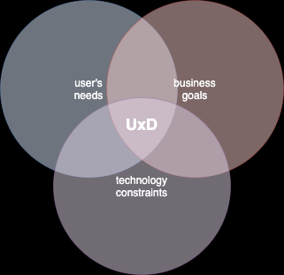

### CSCI-UA.480-069: Agile Software Development & DevOps

#### Prof. Amos Bloomberg, Spring 2022

*NODE.JS IS THE FOCUS, BUT ANY LANGUAGE IS ALLOWED*

# Table of Contents

| Section | Title |
| ------- | ----- |
| 01 | [Scrum](#01) |
| 02 | [Git & GitHub](#02) |
| 03 | [Web Architecture](#03) |
| 04 | [Javascript](#04) |
| 05 | [UI/UX](#05) |
| 06 | [React](#06) |

# Mission Statement

You're here to learn about a specific development called Agile DevOps. Its a rigid process of making a product.

<a id="01"></a>
# Scrum

What is it? _Framework following the rules of agile devops_

Scrum can be divided into three main components, roles, events, & artifacts

__roles__ - what is each member responsible for
- product owner - communicates with stakeholders, manages Product Backlog and User Stories
- scrum master - enforces rules of Scrum, facilitates Daily Scrum, assists in maintaining Product Backlog and User Stories
- developer
- stakeholder

__events__ - important goals, items, milestones, etc. 
- backlog creation
- sprint planning
- daily scrum/daily standup - team meeting
    - "What have you worked on since last standup?""
    - "What are you working on now?"
    - "Is there anything blocking your work?"
- backlog grooming - refining the list of functionality
- sprint review
- stakeholder demo
- team retrospective

__artifacts__ - sources of development information
- sprint backlog - User Stories relevant to one specific sprint
- product backlog - User Stories relevant to entire product
- potentially reasonable product increment (not talked abt)

__sprints__ - working in a couple week period


__User Stories__ - Non-techinical sentence describing a product feature (As a \_\_\_, I want to \_\_\_, so that \_\_\_). Follows the INVEST acronym.  
__Planning Poker__ - technique for determining the Estimate of Effort of any User Story (Fibonacci Numbers)

__Spike__ - work that needs to be done that is not end-user-facing

__Cone of Uncertainty__ - uncertainty decreases as development increases.  
Agile's incremented structure minimizes the cone.

<a id="02"></a>
# Git & GitHub

Git is a version control system.

There are older version control systems, such as Subversion

- Git
    - Distributed
- Subversion & CVS
    - Centralized

<a id="03"></a>
# Web Architecture

I skipped class 🥴

<a id="04"></a>
# Javascript

Can run serverside (node.js) and clientside (browser).

Loosely typed variables
- var - function scoped, reassignable
- let - block scoped, reassignable
- const - block scoped, not reassignable

Protoypal inheritance (how tf this work?)

Functions can be instantiated in a lot of different ways

```javascript
// standard
function doSomething1() {
  console.log("doSomething1 is running")
}

// anonymous
const doSomething2 = function () {
  console.log("doSomething2 is running")
}

// arrow
const doSomething3 = () => {
  console.log("doSomething3 is running")
}

// immediately-invoked function expression (IIFE)
// Note that it is convention to place a semi-colon (;) before an immediately-invoked function in order to ensure it is interpreted as a separate statement from whatever comes above it in the code.
;(function doSomething4() {
  console.log("doSomething4 is running")
})

// new Function object
const doSomething5 = new Function("console.log('doSomething5 is running');");
```

### Objects

A lot of data structs are extensions of objects (arrays, functions, etc.)

Methods can be attached to objects, so objects in a way are similar to classes.

The `this` keyword works similar to Java  
(But there are some nuances to it according to AIT, I forgot what they were...)

```javascript
// an object with a method belonging to it
const fido = {
  name: "Fido",
  breed: "Schnauzer",
  bark(message) {
    console.log(`${this.name} the ${this.breed} says, '${message}'`)
  },
}

// make a copy of an object - this is prototypal inheritance
const f = Object.create(fido)
f.bark('my asscrack')
```

```javascript
function Dog(name, breed) {
  this.name = name
  this.breed = breed
  this.bark = message => {
    console.log(`${this.name} the ${this.breed} says, '${message}'`)
  }
}

// instantiate an object and call its method
let fido = new Dog("Fido", "Schnauzer")
fido.bark("Woof!")
```

### Arrays

- `forEach` loops through the array
- `map` transforms each array element, creates new array (transforms entire array)
- `filter` creates subset of array

### Asynchronicity

__Callbacks__ - function that is called once a certain task completes

```javascript
// a function that accepts two callbacks - one for success, one for failure
let doIt = (callbackSuccess, callbackFailure) => {
  // imagine this function did an asynchronous task and then...
  // - called callbackSuccess() function if task is successful
  // - called callbackFailure() function if task failed
}
// call the function, pass two callback functions to handle its success or failure
doIt(
  res => {
    console.log(`Success: ${res}`)
  },
  err => {
    console.log(`Failure: ${err}`)
  }
)
```

__Promises__ - a datatype that promises to do something once it is ready (this shit is super fucking confusing)

```javascript
// a function that returns a Promise
let doIt = () => {
  return new Promise((resolve, reject) => {
    // imagine this function did an asynchronous task and then...
    // - called resolve('hooraah') if task is successful
    // - called reject('boo!') if task failed
  })
}
// call the function, pass functions to handle its success or failure, whenever it completes
doIt()
  .then(res => {
    console.log(`Success: ${res}`)
  })
  .catch(err => {
    console.log(`Failure: ${err}`)
  })
```

__Async/Await__ - keywords that abstract promises

```javascript
let doIt = async () => {
  // this function automatically returns a Promise, even if it doesn't say so
  return "hoorah!" // 'hoorah' will be automatically passed as the argument to the resolve function of the Promise
  else throw "boooo!"
}
const res = await doIt()
console.log(res)
```

<a id="05"></a>
# UI/UX

__User Experience Design (UX)__ - making a product that accomplishes the goals of users as well as the business



__Visual Design__ - the actual looks of the product  
__User Interface Design (UI)__ - Visual designer for software

UI AND UX ARE NOT EXACTLY THE SAME

Possible documents to be created:
- discovery document - documents what has been discovered at a high level
- requirements document(s) - one or more documents outlining what must be done (e.g. business requirements, technical requirements, functional requirements, design requirements, content requirements)
- content strategy - how to approach the problem of developing content for the target audience
- personas - imaginary stereotypes of the different types of end-users of concern
- user scenarios - a form of requirements sometimes misleadingly called "use cases" - these describe situations in which end-userss may find themselves and how the product or service meets their needs

__site/app map__ - tree diagram of website routes, the overall structure of a website

Goals of a site map:
- number of unique design templates
- categories of screens that exist in a site
- number of levels of screens

__wireframe diagrams__ - design template of a site screen

Goals of a wireframe diagram:
- type of content will be on each screen
- approximate position and size of each piece of content
- notes about any content or interactive behavior that is not obvious


__flow diagram__ - chart of how screens and/or elements can interact w/ each other

User Acceptance Testing ??

### Wireframes

### Prototyping

<a id="06"></a>
# React.js

Front end framework that generates html for you

__JSX__ - basically React html

__Component__ - independent and reusable bits of code. Returns JSX

As of 2022, functional components are the norm, as opposed to class components

hooks, props
